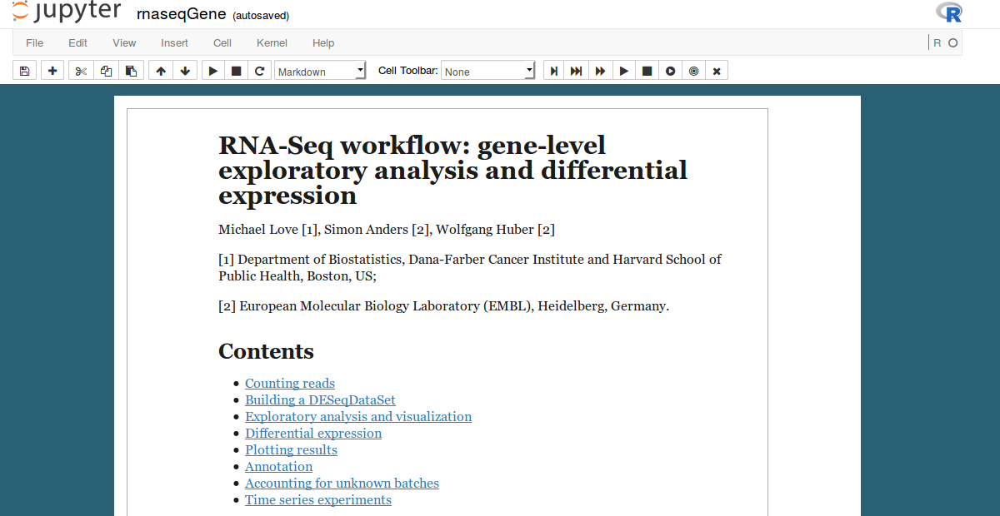
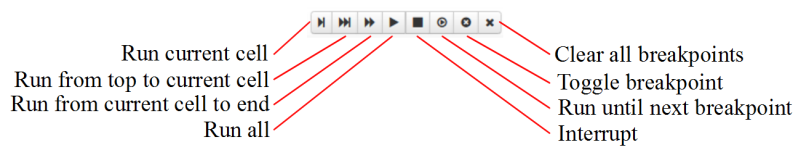

# Introduction
The [**Jupyter notebook**](https://jupyter.org/) is an interactive environment for code evaluation, exploratory data analysis and reporting. In a notebook file it is possible to combine Markdown, program code as well as its output in corresponding input and output cells. 


The primary motivation for using Jupyter notebooks is the ease of producing technical reports, software documentation, tutorials, etc, as the code snippets can be included directly in the document and the output is produced on the fly. This feature may draw comparisons to Markdown, but the main advantage of Jupyter notebooks is that notebook files do not require compilation: in order to view the output, one doesn't have to "knit" the whole document every time.


Normally Jupyter notebook files are not distributed per se. Instead, notebook files are converted to static formats, most commonly HTML. An often overlooked potential of Jupyter notebooks rests in the format's dynamic, interactive nature. The prospect of distributing "live" Jupyter notebooks opens the possibility of truly interactive document types suitable for tutorials and demonstrations. 


Historically the Notebook application was introduced in IPython back in 2011. The Notebook app has evolved to support most of the commonly used programming languages and was renamed to Jupyter in 2014. In this vignette, the terms Jupyter and IPython notebook will be used interchangeably. However, note that user commands and interface descriptions refer to [**IPython Notebook 3.2.1**](https://ipython.org/ipython-doc/3/notebook/index.html)


# Distribution of Jupyter Notebooks
## Docker Images and Docker Hub
The IPython pipeline is notoriously difficult to install on certain operating systems. To facilitate the distribution of Jupyter notebooks, the use of [**Docker**](https://www.docker.com/) virtualization environment is suggested. Docker provides the system of images and containers for running applications in a Linux-like environment without the need of full virtualization.


The [**base Docker image**](https://hub.docker.com/r/vladkim/ipynb/) for IPython toolset can be found in the registry of [**Docker Hub**](https://hub.docker.com/) under the repository name: **vladkim/ipynb**. Essentially, this base image contains all the dependencies required for running IPython notebook together with the [**R kernel**](https://github.com/IRkernel/IRkernel). 


The [**ipynb base image**](https://hub.docker.com/r/vladkim/ipynb/) was used to build a Docker image for the [**Bioconductor RNA-seq workflow**](http://www.bioconductor.org/help/workflows/rnaseqGene/) in IPython notebook format. On Docker Hub the image of the RNA-seq workflow is listed as [**vladkim/rnaseq**](https://hub.docker.com/r/vladkim/rnaseq/).


Note that in the base image IPython Notebook application is used and not Jupyter. There is a subtle difference between the two, since the announcement of the ["Big Split"](https://blog.jupyter.org/2015/04/15/the-big-split/) in April, 2015. The Jupyter notebook has diverged little from its original, but enough to cause problems, which is why the putatively more stable IPython Notebook is used for the time being.

## Aesthetics and Usability of Notebooks
Even though inline CSS and JavaScript declarations are ignored in IPython Notebook 3.\* series, it is possible to change the default appearance of the notebook application using `custom.css` and `custom.js` files in ~/ipython/profile_default/static/custom/ directory. 




The `custom.css` file used for styling IPython notebook in the base Docker image is available on [GitHub](https://github.com/vladchimescu/Docker-images).


In addition to the custom CSS theme, the IPython notebook in the base Docker image loads a JavaScript extension ["Breakpoints"](https://github.com/ipython-contrib/IPython-notebook-extensions/wiki/Breakpoints) to enhance code execution options. The JavaScript notebook extension ["Breakpoints"](https://github.com/ipython-contrib/IPython-notebook-extensions/wiki/Breakpoints) adds the following tool bar:


Since there is no implicit caching of environmental variables, function and object definitions, upon restart of the notebook each cell has to be run up to the point where the reader has stopped. By default in IPython notebook only one code cell can be run at a time. Using the "Breakpoints" toolbar one can run "from top to current cell" (second from left) or set a breakpoint, i.e. a bookmark, and run from the first cell until the next bookmark is encountered.

## Creating Your Own Docker Image


# Conversion to IPython Notebook Format
## R Markdown to Jupyter
To convert documentation in R Markdown into Jupyter notebook format, use the CRAN package [**rmarkdown**](https://cran.r-project.org/web/packages/rmarkdown/index.html) first to render the .Rmd file into Markdown Github:
```{r rmd1, eval=FALSE}
library(rmarkdown)
render("vignette.Rmd", md_document(variant = "markdown_github"))
```

If your documentation contains typeset math in LaTeX notation, run instead
```{r rmd2, eval=FALSE}
render("vignette.Rmd", md_document(variant = "markdown_github+tex_math_dollars"))
```

The pandoc extension `+tex_math_dollars` ensures that the LaTeX math is typeset correctly in markdown. 


Next use [**notedown**](https://github.com/aaren/notedown.git) to convert the produced Markdown file into Jupyter notebook format. With [**notedown**](https://github.com/aaren/notedown.git) simply run in bash

```
$ notedown -o output.ipynb --nomagic input.md

```
The `--nomagic` flag suppresses `%%R` prefix tags in code blocks necessary for running R code with the native Python kernel. 
After converting the Rmd vignette into Jupyter notebook, the last step would be to switch to the [**R kernel**](https://github.com/IRkernel/IRkernel.git) in the notebook interface. Thus run 
```
$ ipython notebook output.ipynb
```
This will open the notebook in your browser. Click on **Kernel** tab -> **Change kernel** -> **R**.

The current version of [**notedown**](https://github.com/aaren/notedown.git) supports the direct conversion of R markdown to Jupyter notebook format. However, it is recommended to render R Markdown into `markdown_github` before applying [**notedown**](https://github.com/aaren/notedown.git)

## Conversion of Sweave vignettes
The conversion of Rnw vignettes is somewhat more complicated, since Sweave vignettes contain both TeX and R syntax.

+ *Step 1*: Produce a TeX file using `Sweave()` function. Run in R
```
> options(prompt=" ", continue=" ")
> Sweave("vignette.Rnw", eval=FALSE)
```
The `options(...)` command overwrites the default `options(prompt=">", continue="+")` for prepending ">" in the beginning of each line and "+" for line continuation.

+ *Step 2*: In the produced TeX file comment out the usage of Sweave.sty and add **listings** package instead:
```
%\usepackage{Sweave}
\usepackage{listings}
```
and remove instances of `\begin{Schunk}` and `\end{Schunk}`. Replace all `{Sinput}` environment with `{lstlisting}`. Replace all Biconductor.sty macros, e.g.~`\R{}` or `\Robj{}`, with corresponding values. It is also recommended to remove all floats in the TeX file (such as `{figure}` environment)

+ *Step 3*: Convert the postprocessed TeX file into a markdown file with [**pandoc**](http://pandoc.org/). Run in bash:
```
$ pandoc input.tex -o output.md
```
+ *Step 4*: The markdown file can be easily converted to Jupyter format with notedown:
```
$ notedown -o output.ipynb --nomagic input.md
```

## knitr Vignettes
To suppress output and overcomplicated code highlighting in knitr-generated documentation, the following options have to be set in R:
```
> knitr::opts_chunk$set(results = "hide", highight = FALSE)
```
The output evaluated is hidden due to `results = "hide"` and the code chunks are enclosed in simple **verbatim** LaTeX environment. The directions for knitting the knitr-TeX vignette are usually provided in the opening comments. In most cases the following would knit the vignette:
```
> library('knitr'); rm(list=ls()); knit('vignette.Rnw')
```
